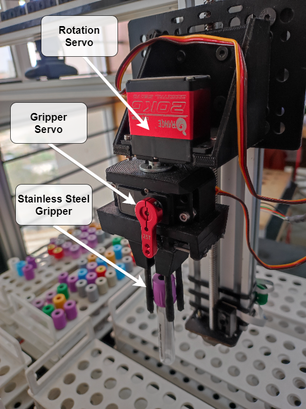

# Gantry Robot for Diagnostics Laboratory Automation

A gantry robot built for automated archiving of vacuum tubes.

 
The hardware is built using aluminum extrusions and mild steel plates for various mounts.
Arduino Mega is used as the microcontroller with DRV8825 stepper motors drivers to drive the stepper motors.

This project also implements the application of object detection in identifying the vacuum tubes. The methodology involves training a model on annotated datasets, employing YOLO algorithm and PyTorch. Leveraging computer vision techniques, the system aims to accurately locate the vacuum tubes and the empty slots through real-time image feed.

- Has a workspace of 600 x 500 x 130 mm
- Three linear axes with a linear velocity range of
  - X-axis: 90-200 mm/s
  - Y-axis: 100-210 mm/s
  - Z-axis: 30-50 mm/s
- The three linear actuators and the wrist with the end effector with two degrees of freedom contribute to the 5-DOF design of the gantry robot
- The Z and Y axes are actuated using stepper motors and belt drive, while the X axis is actuated using a stepper motor and lead screw mechanism.
- A 3D printed end effector with stainless steel ends

## Python Scripts
- Clone the repo.
- Change pins and stepper motors speed and acceleration as per requirements in the [gantry.cpp](arduino_code/gantry.cpp) file.
- Upload the Arduino Code in the [arduino_code](arduino_code) folder.
- run the main.py file.
- Home the gantry before running any command.

## Future Improvements
- Replacing idler pulleys with optical encoders, can be used to keep track of the position.
- Replacing stepper motors with better motors with hugh torque at higher rpm.
- Realtime dynamic coordinates from image processing.
- Improve X-Axis to increase vertical workspace.